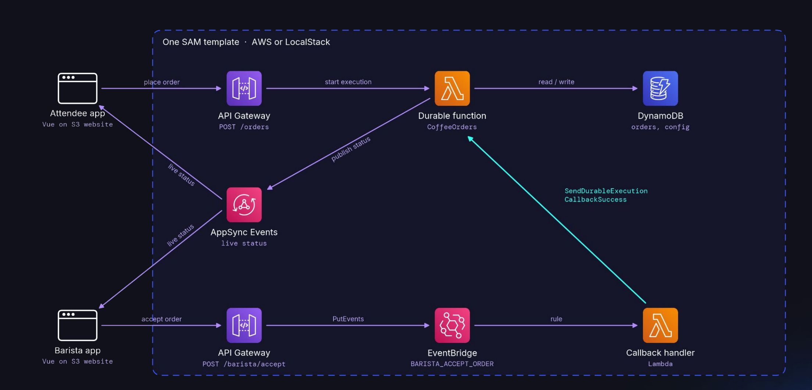

# Serverlesspresso with Lambda Durable Functions on LocalStack

| Key          | Value                                                                                          |
| ------------ | ---------------------------------------------------------------------------------------------- |
| Environment  | LocalStack, AWS                                                                                |
| Services     | Lambda (durable functions), API Gateway, DynamoDB, EventBridge, AppSync Events, S3, CloudFormation |
| Integrations | AWS SAM, AWS CLI, lstk, Jest, Playwright                                                       |
| Categories   | Serverless, Event-Driven Architecture                                                          |
| Level        | Intermediate                                                                                   |
| Use Case     | Lambda Durable Functions, Integration Testing, Resource Browser, App Inspector, Persistence     |
| GitHub       | [Repository link](https://github.com/localstack-samples/durable-serverlesspresso)              |

## Introduction

This sample runs Serverlesspresso, a coffee ordering app built on [AWS Lambda durable functions](https://docs.aws.amazon.com/lambda/latest/dg/durable-functions.html), on LocalStack. An attendee orders a coffee, a barista accepts it and then completes it, and both screens update in real time.

The whole order workflow is one durable function. It writes the order, checks two things in parallel, queues the order and then waits for the barista with `waitForCallback`. While it waits, nothing runs. When the barista acts, a callback resumes the execution, and the function replays from the top and skips the steps that already finished.

The app is a fork of [singledigit/durable-serverlesspresso](https://github.com/singledigit/durable-serverlesspresso) by Eric Johnson. This fork adds:

- A `Makefile` and a project `lstk` config, so the app deploys to LocalStack with `make deploy`.
- A test suite that runs against LocalStack: 15 Jest integration tests and a Playwright test that drives the UI. The original unit tests, which use the durable execution SDK's local test runner, still run as they are.
- Two template parameters that make the barista timeouts configurable, so the tests can run the timeout paths in seconds instead of minutes. The defaults keep the original two minutes.

The same template deploys to AWS without changes.

## Architecture



- [Lambda](https://docs.localstack.cloud/aws/services/lambda/) runs the `CoffeeOrders` durable function (the order workflow), the callback handler that resumes it, a function that publishes status events, and a function that returns an execution's history to the UI.
- [API Gateway](https://docs.localstack.cloud/aws/services/apigateway/) starts an execution for each new order, puts barista actions on EventBridge, and reads orders straight from DynamoDB.
- [DynamoDB](https://docs.localstack.cloud/aws/services/dynamodb/) stores the orders, including the callback ID the workflow is waiting on, and the event configuration.
- [EventBridge](https://docs.localstack.cloud/aws/services/events/) routes barista actions and cancel requests to the callback handler, which reads the callback ID from the order and calls `SendDurableExecutionCallbackSuccess`. A second rule sends status events to the publisher function.
- [AppSync Events](https://docs.localstack.cloud/aws/services/appsync/) pushes every status change to the attendee and barista screens over a WebSocket.
- [S3](https://docs.localstack.cloud/aws/services/s3/) hosts the Vue frontend as a static website.
- [CloudFormation](https://docs.localstack.cloud/aws/services/cloudformation/) deploys everything from one SAM template.

## Prerequisites

- A [LocalStack account](https://app.localstack.cloud/sign-up) with a paid plan or a trial. Durable executions are not available on the free Hobby plan.
- [`lstk`](https://docs.localstack.cloud/aws/getting-started/installation/), the LocalStack CLI: `brew install localstack/tap/lstk` or `npm install -g @localstack/lstk`
- [Docker](https://docs.docker.com/get-docker/)
- [AWS SAM CLI](https://docs.aws.amazon.com/serverless-application-model/latest/developerguide/install-sam-cli.html) 1.166 or later. Older versions reject the `DurableConfig` property.
- [AWS CLI](https://docs.aws.amazon.com/cli/latest/userguide/getting-started-install.html), recent enough to have the durable execution commands (check with `aws lambda get-durable-execution-history help`)
- [Node.js](https://nodejs.org/) 22 and [esbuild](https://esbuild.github.io/) on your `PATH` for `sam build`: `npm install -g esbuild`
- `make`

## Installation

Clone the repository:

```shell
git clone https://github.com/localstack-samples/durable-serverlesspresso.git
cd durable-serverlesspresso
```

Install the frontend and test dependencies:

```shell
make install
```

Run `make` on its own to list all targets. Every target prints the commands it runs.

## Deployment

Start LocalStack from the repository root. `lstk` reads `.lstk/config.toml`, which uses the `dev` image and turns on App Inspector:

```shell
make start
```

Build and deploy the stack, then open the coffee shop:

```shell
make deploy
```

This runs `lstk sam build` and `lstk sam deploy`, the regular SAM CLI pointed at LocalStack, and then seeds the event configuration (store open, three orders per attendee). On a laptop the deploy takes about a minute.

Build the frontend and host it on an S3 website:

```shell
make frontend
```

The output ends with the two URLs:

```shell
Attendee: http://durable-serverlesspresso-frontend.s3-website.localhost.localstack.cloud:4566/attendee
Barista:  http://durable-serverlesspresso-frontend.s3-website.localhost.localstack.cloud:4566/barista
```

## Testing

### Manual testing

Open the barista URL in one browser window and the attendee URL in an incognito window. The app keeps its state in `localStorage`, so the two roles need separate browser profiles.

1. As the attendee, pick a drink and a size and place the order. The order appears on the barista dashboard.
2. As the barista, click **Accept**, then **Complete**. The attendee sees the order move to preparing and then ready.
3. On the barista dashboard, open **History** and **View History** on the order to see the durable execution's steps.

Each wait for the barista times out after two minutes, after which the workflow cancels the order.

> [!NOTE]
> LocalStack's TLS certificate does not cover the AppSync Events realtime host yet, so a regular browser cannot open the realtime WebSocket. The app still works: reload the page to see status changes. The Playwright test ignores certificate errors and checks the live updates.

### Inspect the durable executions

While an order waits for the barista, list the executions of the order workflow:

```shell
make executions
```

The order shows as `RUNNING`, although no invocation is running. Show the event history of the latest execution:

```shell
make history
```

The history lists every step that finished, the two parallel validation branches and, at the end, `wait-acceptance` with `CallbackStarted` and `InvocationCompleted`: the function stopped and waits for the callback. After the barista completes the order, the history shows three invocations and ends with `ExecutionSucceeded`.

### Automated tests

| Target | What it runs |
| --- | --- |
| `make test-unit` | The original unit tests with the durable execution SDK's local test runner. They need no LocalStack. |
| `make test` | 15 Jest integration tests against the deployed stack: placing orders, parallel validation, accept, complete and cancel through EventBridge and the callback handler, both timeouts, the REST API, execution history and the AppSync Events channels. |
| `make test-ui` | A Playwright test against the S3 website: the attendee orders, the barista accepts and completes, and both screens update over AppSync Events. |
| `make test-all` | Redeploys with 15 second timeouts and runs all of the above. |

With the default two minute timeouts, the two timeout tests skip themselves. `make test-all` deploys with `TIMEOUTS=15` so they run. To deploy with short timeouts yourself, run `make deploy TIMEOUTS=15`.

### Continuous integration

[`.github/workflows/integration-test.yml`](.github/workflows/integration-test.yml) runs on every push and pull request, and weekly. It runs the unit tests, starts LocalStack with `lstk`, deploys with `make deploy TIMEOUTS=15` and runs `make test`. It needs a `LOCALSTACK_AUTH_TOKEN` secret.

## Use Cases

### Resource Browser

The [Resource Browser](https://app.localstack.cloud/inst/default/resources) in the LocalStack web app shows the resources of the stack. Open [Lambda](https://app.localstack.cloud/inst/default/resources/lambda/functions) for the four functions and the durable function's logs, and [DynamoDB](https://app.localstack.cloud/inst/default/resources/dynamodb) for the orders and the callback IDs the workflow stored. If Chrome asks to allow access to your local network, allow it so the web app can reach LocalStack.

### App Inspector

[App Inspector](https://app.localstack.cloud/inst/default/appinspector/spans) traces the calls between services. Search for `Invoke` and open **View Graph** on the API Gateway row: it shows API Gateway invoking the durable function, the function writing to DynamoDB, and a `CheckpointDurableExecution` call for each step. `.lstk/config.toml` turns App Inspector on at startup.

### Persistence

With persistence on, a durable execution survives a restart of the emulator. Persistence is off by default, so each `lstk start` begins with an empty emulator. To try it, uncomment `PERSISTENCE = "1"` in `.lstk/config.toml`, restart LocalStack (`make stop start`), deploy with the default timeouts, and run:

```shell
make restart-demo
```

The script places an order, accepts it, restarts LocalStack while the workflow waits for the barista, completes the order and shows that `initialize-order` ran only once.

## Troubleshooting

- **Every order fails and the logs say `Cannot find module 'index'`.** The stack was deployed without a build, so the functions contain the TypeScript sources instead of the esbuild bundle. `sam deploy` uses `.aws-sam/build` only if `sam build` ran first in the same folder. Run `make deploy`, which always builds first.
- **The barista header says "Loading..." and the store toggle fails with `No event loaded`.** The event configuration is missing. `make deploy` seeds it, or run `scripts/seed-config.sh`.

## Cleanup

```shell
make destroy
make stop
```

## Learn More

- [Lambda durable functions on LocalStack](https://docs.localstack.cloud/aws/services/lambda/): supported features and current limitations
- [Testing Lambda Durable Functions Locally with LocalStack](https://blog.localstack.cloud/testing-aws-lambda-durable-functions-locally-with-localstack/)
- [AWS Lambda durable functions](https://docs.aws.amazon.com/lambda/latest/dg/durable-functions.html)
- [`lstk`](https://docs.localstack.cloud/aws/getting-started/installation/)
- [The original app](https://github.com/singledigit/durable-serverlesspresso) and [its walkthrough video](https://youtu.be/XJ80NBOwsow)
